# INVESTelligence
**AI-Powered Financial News Intelligence Agent**

An end-to-end system that transforms noisy financial news into

**ranked, explainable, investor-ready insights** —

running daily in under **10 minutes** at **<$0.30 per run**.

**Tech Stack:** n8n · Python · OpenAI · Tavily · Streamlit · GitHub

**Role:** End-to-end system deDsign, scoring framework, pipeline implementation


## 0. Repository Structure

This repository is organized around a data-to-delivery pipeline, separating automation, storage, and visualization layers for clarity and extensibility.

```text
.
├── workflow/               # n8n workflows (including screenshots, coding part and AI prompts)
│
├── data/                   # Structured data generated from each run
│                           # (cleaned outputs, intermediate files, metrics)
│
├── newsletter_archive/     # Historical newsletter outputs
│                           # used for tracking, analysis, and visualization
│
├── dashboard.py            # Main Streamlit dashboard entry point
│
├── pages/                  # Additional Streamlit pages for data visualization
│
├── .streamlit/             # Streamlit configuration
├── .devcontainer/          # Development environment configuration
│
├── README.md               # Project overview and documentation
└── requirements.txt        # Python dependencies
```

The system follows a layered design:
- **workflow/** handles automation and orchestration (n8n)
- **data/** and **newsletter_archive/** serve as persistent storage for analysis
- **dashboard.py** and **pages/** focus on visualization and user interaction


## 1. At a Glance

- ⏱ **End-to-end runtime:** under 15 minutes
- 💰 **Cost per run:** under $0.30
- 🧠 **Scoring:** Hybrid semantic + quantitative evaluation
- 📬 **Outputs:** Daily investor newsletter + interactive dashboard
- 🎯 **Target users:** Individual investors and prosumers


## 2. Who Is This For

INVESTelligence is designed for users who want **signal, not noise**, but do not have access to professional-grade financial terminals.

**Primary audiences include:**

- **Individual investors** who follow specific companies, sectors, or themes (e.g. Tesla, rare earths, energy transition) and need a daily, filtered view of what actually matters
- **Prosumers and advanced retail investors** who want deeper context than generic news feeds, but without the complexity or cost of institutional platforms
- **Builders and analysts** interested in how AI systems can be designed to surface *decision-relevant intelligence* rather than raw content

This project intentionally does **not** target high-frequency trading, real-time execution, or professional buy-side workflows.

Instead, it focuses on **daily decision support** under realistic cost and time constraints.


## 3. What Makes INVESTelligence Different

INVESTelligence offers more than just news aggregation. It’s a reproducible, cost-efficient, and personalized financial intelligence agent designed for clarity and control.

### 🧩 Reproducible & Modular

- Fully open-source, modular pipeline
- Deployable on both cloud and local (no paid accounts required)
- Easy to debug, audit, and extend

### 🎯 Personalized by Designed

- Scoring tuned to user portfolios, sectors, and trusted sources
- Supports niche themes (e.g., rare earths, EV supply chain)
- Prioritized content, not keyword spam

### 💸 Time- and Cost-Efficient

- **<15 min runtime, <$0.10/run**
- Light resource footprint, API usage minimized

### 📊 Intuitive Output

- Clear daily newsletter + Streamlit dashboard

That’s all you need—clean, explainable signals, delivered automatically.


## 4.  **Deployment Strategy**

### 4.1 Prerequisites

Before initiating the pipeline, the following components and credentials are required:

- **Software:** Docker Desktop, Python 3.9+.
- **API Keys:**
    - **OpenAI API Key:** For semantic expansion and reasoning trace generation.
    - **Tavily API Key:** For real-time financial news retrieval.
    - **Google API Key:** For getting keyword from Google Sheet and receive newsletter from Gmail.
    - **GitHub API Key:** For storing data and visualization.
- **Project Files:** The submission package includes `n8n_workflow.json` (automation logic) and `streamlit` [(visualization interface)](https://investelligence.streamlit.app/).

### 4.2 System Architecture Setup (Local)

If you do not have n8n membership, running this workflow locally is highly preferred.

**Step 1: Environment Preparation**

Create a project directory to serve as the shared volume for data exchange:

```bash
`# Create project root and data folder
mkdir -p investelligence_project/data
cd investelligence_project
# Place user_prefs.json inside the /data folder for n8n to read`
```

**Step 2: Deploying the n8n Automation Agent**

We utilize the self-hosted version of n8n via Docker. Crucially, we map the local data folder to the container to ensure data persistence.

**Command to start n8n:**

```bash
`docker run -it --rm \
  --name n8n \
  -p 5678:5678 \
  -v "$PWD/data":/mnt/data \
  -v ~/.n8n:/home/node/.n8n \
  n8n-io/n8n`
```

- **Access:** Open `http://localhost:5678`(or your address shown in Terminal), import `n8n_workflow.json`, and input the necessary API credentials.

### 4.3 System Architecture Setup (Cloud)

For users who prefer a managed execution environment, INVESTelligence can be deployed directly on **n8n Cloud** with minimal setup.

- Import the provided `n8n_workflow.json` into n8n
- Configure required API credentials (OpenAI, Tavily, Google)
- Enable scheduled triggers for automated daily execution

The workflow logic, scoring pipeline, and output behavior remain **identical** to the self-hosted setup. However, this needs your membership of n8n.‘


## 5. System Architecture

The system adopts a **headless-style architecture**, where execution, storage, and presentation are fully decoupled.

**n8n** acts as the orchestration backend, while **GitHub** is used as a lightweight, versioned data store, enabling reproducibility and transparent inspection.

### 5.1 High-Level Data Flow

```mermaid
graph TD
    A["⏰ Schedule Trigger (8:00 AM)"] --> B["🧠 n8n Workflow Engine"]
    B --> C["🔁 For Each Keyword"]
    C --> D["🌐 Tavily News API"]
    D --> E["🧹 Clean & Deduplicate"]
    E --> F["🤖 OpenAI Semantic Scoring"]
    F --> G["🧮 Filter & Rank (final_score ≥ 50)"]
    G --> H1["📁 Output: ranked_news.csv + metrics.json"]
    H1 --> I1["📬 Email Newsletter Generator"]
    H1 --> I2["📊 Streamlit Dashboard"]

    I1 --> J1["🗂️ Newsletter Archive (by Date)"]
    I2 --> J2["📈 Dashboard: Impact × Sentiment"]

```



### 5.2 Core Components

1. **Orchestration Layer (n8n)**
    - Coordinates end-to-end execution, scheduling, and error handling.
    - Manages control flow between retrieval, scoring, filtering, and delivery stages.
    - Chosen for its visual, inspectable workflow representation, making execution logic explicit and auditable.
2. **Retrieval Layer (Tavily)**
    - Uses Tavily instead of general-purpose search engines.
    - Optimized for LLM consumption, providing cleaner, evidence-focused financial content.
    - Reduces noise and hallucination risk introduced by SEO-driven sources.
3. **Cognitive Layer (LLM + Python)**
    - Performs semantic evaluation, relevance scoring, and cross-article reasoning.
    - Supports both macro-level theme monitoring and micro-level portfolio-specific analysis.
    - **Key design choice**: a Semantic Expansion module that extends beyond keyword matching (e.g., incorporating upstream supply-chain signals when analyzing Tesla).
4. **Storage & Presentation Layer (GitHub + Streamlit)**
    - Processed outputs (ranked news, sentiment metrics) are persisted as versioned CSV/JSON files.
    - GitHub serves as a transparent, reproducible storage layer.
    - A Streamlit dashboard consumes these files directly, providing interactive visualization and acting as the primary user-facing interface.


## 6. Intelligence & Scoring Design

The core of INVESTelligence is not data collection, but **judgment**.

This system is designed to decide *what matters*, *to whom*, and *why*—under strict cost and runtime constraints.

### 6.1 From News to Signals

Raw financial news is noisy, redundant, and uneven in quality.

INVESTelligence transforms unstructured articles into **ranked, decision-relevant signals** through semantic evaluation, relevance assessment, and explicit filtering.

Only high-impact items are retained for downstream outputs.

### 6.2 Hybrid Scoring: Semantic + Quantitative

To balance interpretability and robustness, INVESTelligence evaluates each article through **two complementary scoring layers**: semantic materiality and quantitative quality.

**Layer 1: Semantic Materiality (LLM-Driven)**

The system first assesses the **economic relevance** of an article using an LLM-based evaluator.

Each article is scored across three dimensions on a 0–4 scale (normalized to 0–1):

- **Event Severity** – the inherent economic significance of the event
- **Market Proximity** – how directly the event relates to the user’s portfolio or core themes
- **Forward Impact** – whether the content provides predictive, forward-looking insight rather than retrospective reporting

The resulting materiality score reflects *how much this event should matter to the user*:

$\text{Materiality Score} = \frac{\text{Severity} + \text{Proximity} + \text{Impact}}{12}$

This layer prioritizes **substance over popularity**, allowing the system to surface important but underreported signals.

**Layer 2: Quantitative Quality (Rule-Based)**

To stabilize semantic judgment, a second layer evaluates **structural quality signals** using deterministic Python logic:

- **Source Credibility (40%)** – domain-based authority weighting, capped to avoid dominance
- **Topic Importance (25%)** – interaction between user-defined interest weights and AI expansion relevance
- **Search Relevance (20%)** – derived from Tavily relevance scores, penalizing off-topic coverage
- **Market Pickup (15%)** – normalized measure of cross-source coverage, capped to highlight consensus

These components form a bounded quality score:

$\text{Quality Score} = (C \times 0.40) + (T \times 0.25) + (S \times 0.20) + (P \times 0.15)$

This layer ensures that high-authority sources do not override relevance, and that isolated noise is filtered out.

**Final  Synthesis**

The final ranking score combines both layers, with **semantic materiality weighted more heavily** than source quality:

$\text{Final Score} = (\text{Materiality} \times 0.6) + (\text{Quality} \times 0.4)$

Only articles exceeding a minimum threshold are retained, and each theme is capped to a small set of high-signal items for delivery.

### 6.3 Semantic Expansion Beyond Keywords

To avoid keyword blindness, the system applies **semantic expansion**.

Rather than querying only literal terms (e.g., *“Tesla”*), it incorporates related upstream and contextual signals (e.g., supply-chain or regulatory events), surfacing indirectly relevant but materially important news.

### 6.4 Thresholding and Noise Control

Information overload is addressed through **explicit thresholding**.

Articles below a relevance threshold are discarded, and each theme is capped to a small, high-signal set.

This prioritizes **signal density over coverage.**

### Summary

INVESTelligence treats intelligence generation as a **design problem**, not a modeling contest.

By combining semantic judgment with explicit constraints, the system produces outputs that are **ranked, explainable, and usable in practice**.


## 7. Visualization & Interface Layer

The visualization layer translates ranked intelligence into **human-readable insight**.

Its goal is not to expose system complexity, but to help users quickly understand *what matters*, *why it matters*, and *how signals relate to each other*.

### 7.1 Two Complementary Interfaces

INVESTelligence provides two output modes, designed for different cognitive contexts:

- **Daily Newsletter (Push-based)**
    
    A concise daily digest highlighting top-ranked signals per theme.
    
    Designed for rapid scanning and decision priming.
    
- **Interactive Dashboard (Pull-based)**
    
    [A Streamlit-based interface](https://investelligence.streamlit.app/) for exploration, comparison, and deeper inspection.
    
    Designed for users who want to investigate *why* certain items ranked highly.
    

Both interfaces consume the **same scored outputs**, ensuring consistency between summary and exploration.

### 7.2 Cognitive Design Principles

Visualization choices prioritize **interpretability over density**:

- **Ranking-first layout** emphasizes relative importance rather than raw volume
- **Impact × Sentiment positioning** helps users distinguish magnitude from tone
- **Explicit score breakdowns** reinforce trust and explainability

Rather than maximizing information, the interface is designed to **minimize cognitive load**.

### 7.3 Light Technical Notes

- Implemented using **Streamlit** for rapid iteration and transparency
- Reads directly from versioned CSV/JSON outputs
- No hidden state or proprietary UI layer

This lightweight setup keeps the interface tightly coupled to the underlying intelligence logic without introducing additional abstraction.

### Summary

The visualization layer completes the intelligence loop:

**from automated judgment to actionable understanding**.

By separating scoring from presentation while preserving transparency, INVESTelligence ensures that insights are not only accurate—but usable.


## 8. Design Trade-offs & Constraints

- **Opinionated over comprehensive**
    
    Prioritizes signal density over full coverage; missing low-impact news is an acceptable trade-off to reduce cognitive overload.
    
- **Transparency over model complexity**
    
    Favors inspectable scoring logic and explicit weights instead of opaque, highly complex models.
    
- **Daily cadence over real-time reaction**
    
    Designed for daily decision support, not high-frequency or real-time trading scenarios.
    
- **Lightweight infrastructure over scale**
    
    Uses simple storage and orchestration to remain reproducible and easy to modify, at the cost of large-scale extensibility.
