# Final Report

Hi, when you read this markdown, congratulations to me (who finally finishes this project) and god bless you(who has to read this and figure out the long and complicated workflow).

This project takes me whole 2 months to build. I have to admit that 

1. dealing with text data is far more difficult than I imagine and than numeric data.
2. I dreamt big, but unfortunately some functions are still in my dreams.
3. Data Science jobs are not my thing - I am dying during the finals.

---

## 0.  Project Overview

**INVESTelligence** is an automated, AI-driven financial newsletter agent designed to solve the "information overload" problem for individual investors(especially staters).

Investment analysis often involves drowning in low-quality content or paying for expensive APIs. This project proves that high-quality, personalized market intelligence can be built efficiently and cost-effectively.

- **The Problem**: Beginners struggle to filter noisy web data, while professional tools are costly and complex.
- **The Solution**: A "factory-style" agent workflow that runs daily for **under $0.3/day**. It turns raw, messy web data into structured, evidence-based insights.
- **Core Philosophy**: *Maximize insight, minimize token usage.*

Instead of relying on black-box AI, this system uses a transparent **two-layer scoring mechanism** (Semantic + Quantitative) to ensure every piece of news delivered is relevant, reliable, and actionable.

### 0.1 What is n8n?

[**n8n**](https://n8n.io/) (short for "node node") is an open-source **workflow automation tool** that allows users to connect APIs, databases, and code blocks through a **visual drag‑and‑drop interface**. Think of it as an “automation glue” that connects data sources, triggers, and logic without writing boilerplate code.

In this project, n8n serves as the **Orchestration Layer** – it scrapes, expands, filters, and ranks financial news articles across multiple sources using a modular pipeline. Each node (e.g., HTTP request, LLM call, JSON transform) represents a functional unit, making the system easy to modify and debug.

### 0.2 Key Updates After Dec 1st

- **Transition to Local Deployment:** Shifted from cloud infrastructure to a local Node.js environment using `npx`. This lightweight approach simplifies the testing loop and eliminates the need for complex container management
- **Streamlined Workflow Architecture:** Refined the automation logic by removing redundant nodes and optimizing the data formatting steps. The resulting workflow is cleaner, easier to debug, and more stable
- **Performance & Cost Optimization:** Fine-tuned the prompts in the LLM Evaluation layer to reduce token consumption and latency.
    - **Time Efficiency:** Total execution time reduced from **25 minutes to under 10 minutes**.
    - **Cost Control:** Operational cost per run is now strictly maintained **below $0.30**.
- **Visualization** **Upgrade:** Transformed the dashboard into a full-fledged web app with a **landing page, interactive dashboard, and newsletter archive**. Both the dashboard and newsletter now support **historical data navigation** for improved usability.

## 1. Deployment & Execution Strategy

To ensure reproducibility and ease of assessment, the INVESTelligence pipeline is designed for a fully local deployment using Docker and Python. This approach allows the system to operate cost-effectively without requiring persistent cloud infrastructure.

### 1.1 Prerequisites

Before initiating the pipeline, the following components and credentials are required:

- **Software:** Docker Desktop, Python 3.9+.
- **API Keys:**
    - **OpenAI API Key:** For semantic expansion and reasoning trace generation.
    - **Tavily API Key:** For real-time financial news retrieval.
    - **Google API Key:** For getting keyword from Google Sheet and receive newsletter from Gmail.
- **Project Files:** The submission package includes `n8n_workflow.json` (automation logic) and `streamlit` [(visualization interface)](https://investelligence.streamlit.app/).

### 1.2 System Architecture Setup (Local)

The system relies on a **Shared Local Volume** architecture. n8n (running in Docker) writes analysis results to a specific local folder, which the Streamlit dashboard (running on the host machine) monitors and reads in real-time.

**Step 1: Environment Preparation**

Create a project directory to serve as the shared volume for data exchange3333:

```bash
`# Create project root and data folder
mkdir -p investelligence_project/data
cd investelligence_project
# Place user_prefs.json inside the /data folder for n8n to read`
```

**Step 2: Deploying the n8n Automation Agent**

We utilize the self-hosted version of n8n via Docker. Crucially, we map the local data folder to the container to ensure data persistence.

**Command to start n8n:**

```bash
`docker run -it --rm \
  --name n8n \
  -p 5678:5678 \
  -v "$PWD/data":/mnt/data \
  -v ~/.n8n:/home/node/.n8n \
  n8n-io/n8n`
```

- **Access:** Open `http://localhost:5678`, import `n8n_workflow.json`, and input the necessary API credentials.

### 1.3 Deliverables for Evaluation

The final submission includes:

1. **`n8n_workflow.json`**
    
    The complete automation schema, including nodes for **scheduled runs**, **user preference filtering**, **multi-source news fetching**, and **semantic evaluation**.
    
2. **GitHub Repository：**[https://github.com/ZihanSuo/INVESTelligence](https://github.com/ZihanSuo/INVESTelligence) Hosts all source code, processed output data, and version-controlled visual assets.
3. **Streamlit Web App**
    
    An interactive front-end for **visualizing ranked news**, exploring **sentiment trends**, and **accessing past newsletters** via a structured UI.
    

## 2. System Architecture

The system follows a **Headless CMS** architecture, where **n8n** acts as the backend orchestrator and **GitHub** serves as the database, decoupling data processing from visualization.

### 2.1 High-Level Data Flow

```mermaid
graph TD
    A["⏰ Schedule Trigger (8:00 AM)"] --> B["🧠 n8n Workflow Engine"]
    B --> C["🔁 For Each Keyword"]
    C --> D["🌐 Tavily News API"]
    D --> E["🧹 Clean & Deduplicate"]
    E --> F["🤖 OpenAI Semantic Scoring"]
    F --> G["🧮 Filter & Rank (final_score ≥ 50)"]
    G --> H1["📁 Output: ranked_news.csv + metrics.json"]
    H1 --> I1["📬 Email Newsletter Generator"]
    H1 --> I2["📊 Streamlit Dashboard"]

    I1 --> J1["🗂️ Newsletter Archive (by Date)"]
    I2 --> J2["📈 Dashboard: Impact × Sentiment"]

```



### 2.2 Core Components

1. **Orchestration Layer (n8n)**
    - Acts as the central nervous system. Sends a newsletter everyday to the email address.
    - Manages the execution flow, error handling, and coordination between AI agents and Python scripts.
    - **Why n8n?** Visualizes the logic of "agents as factory workers," where each node performs a specific task (e.g., planning, researching, editing) and passes the output to the next.
2. **Retrieval Layer (Tavily)**
    - Replaces noisy general search engines (like Google) with **Tavily**, an API optimized for LLMs.
    - Provides clean, evidence-based content without ads or SEO spam, reducing hallucination risks for the AI.
3. **Cognitive Layer (LLM & Python)**
    - **Macro Monitoring**: Automatically identifies 3-5 key market themes daily.
    - **Micro Analysis**: Deep-dives into specific user portfolios (e.g., "Tesla", "Rare Earth").
    - **Key Innovation**: Uses a **Semantic Expansion Module** to look beyond keyword matching (e.g., searching for "upstream lithium prices" when analyzing "Tesla").
4. **Storage & Presentation Layer (GitHub + Streamlit)**
    - **Storage**: Processed data (sentiment scores, word clouds, ranked news) is pushed to this GitHub repository as CSV/JSON files.
    - **Visualization**: A **Streamlit** app reads raw files directly from the repo, overcoming n8n's lack of native UI. it is a link inserted in the newsletter.

## 3. Workflow Breakdown & Key Components

The system architecture is designed as a parallel processing pipeline, mimicking a factory floor where different "agents" (nodes) handle specialized tasks simultaneously. The workflow splits into two primary streams immediately after the daily trigger.

### 3.1 The Dual-Stream Architecture

- **Stream A: Macro Monitoring (The Generalist)**
    - **Objective:** To capture the broad market mood and identify 3-5 dominant themes daily.
    - **Process:** A "Planning Agent" scans raw headlines to propose topics, followed by "Researcher Agents" that fetch details, culminating in an "Editor Agent" that synthesizes a market summary.
    - **Role:** Acts as the automated "Chief Editor," ensuring the user is aware of the big picture.
        
        
        
        Macro Monitoring
        
- **Stream B: Micro Analysis (The Specialist)**
    - **Objective:** To perform deep-dive due diligence on specific user portfolios (e.g., "Tesla", "Rare Earths").
    - **Process:** This stream executes complex operations including **Semantic Expansion**, **Deduplication**, and **Multi-dimensional Scoring** to filter noise and find actionable intelligence.

### 3.2 Core Nodes Explained

To process unstructured web data into structured insights, the workflow relies on four critical types of nodes, each serving a distinct engineering function(examples are provided): 

**🧠 1. The Cognitive Engine: OpenAI Nodes**

- **Function:** Interfaces with the GPT-4o-mini/GPT-5-mini model.
- **Application in Workflow:**
    - Instead of simple chatbots, these nodes are configured with **System Prompts** that enforce strict JSON output.
    - Used for **Semantic Expansion** (converting a keyword like "Tesla" into a search strategy) and **Materiality** **Scoring** (evaluating articles for event severity and market proximity).
    - *Why it matters:* It transforms unstructured text into computable data structures.

**🔗 2. The Synchronizer: Merge Node**

- **Function:** Functions similarly to a `SQL JOIN` operation in database management.
- **Application in Workflow:**
    - Crucial for the **Two-Layer Scoring System**.
    - It merges the **Semantic Score** (generated by LLM) with the **Quantitative Score** (calculated by Python based on source credibility) into a single data object.
    - *Why it matters:* Ensures that the final ranking considers both the *content* quality and the *source* reputation.

**🛠️ 3. The Formatter: Edit Fields (Set) Node**

- **Function:** Handles ETL (Extract, Transform, Load) tasks and Schema Normalization.
- **Application in Workflow:**
    - Sanitizes the complex, nested JSON responses from the **Tavily API**.
    - Flattens data structures to ensure downstream Python scripts receive clean, consistent inputs (e.g., standardizing `title`, `url`, and `content` fields).

**🐍 4. The Logic Engine: Code Node (Python)**

- **Function:** Executes custom algorithmic logic that exceeds the capabilities of low-code tools.
- **Application in Workflow:**
    - **News Deduplication:** Uses `difflib.SequenceMatcher` to calculate headline similarity and cluster repetitive stories.
    - **Sentiment Dispersion:** Calculates not just the average sentiment, but the *variance* (disagreement) in market reporting to identify controversial topics.
    - *Why it matters:* Provides the "Engineering Rigor" of the project, allowing for complex statistical analysis within the automation flow.

## **4. Data Acquisition Strategy & Sources**

To balance data breadth with credibility under strict cost constraints, we implemented a dual-source data acquisition strategy.

### **4.1 Dual-Source Strategy**

Given that most Tier-1 financial media outlets operate behind paywalls, we adopted two distinct pathways to ensure comprehensive coverage:

1. **Tier-1 Media (Targeted Scoping):** Specifically targeting authoritative domains (e.g., Bloomberg, Reuters, WSJ). We extract metadata (Title, URL, Summary) to capture high-level market sentiment without breaching paywalls.
2. **Open Web Search (Broad Discovery):** A wider search across the general web to capture diverse viewpoints, relying on Tavily's AI filtering to retrieve titles, summaries, and credibility scores.

**Time Window:** All data fetches are restricted to the **trailing 24 hours** to ensure timeliness.

### **4.2 Tooling: Tavily AI Search API**

We utilized [**Tavily**](https://www.tavily.com/), a search API optimized for LLMs, which returns clean JSON data rather than raw HTML. This significantly reduced the parsing overhead.

**Cost Management:** We leveraged the free tier (1,000 requests/month), optimizing the workflow to stay within limits while maximizing data yield.

**Implementation Logic in n8n:**

- **For Tier-1 Media:** We used the **HTTP Request Node** to execute raw API calls with a `include_domains` parameter. This forces the search to only look within a curated list of trusted financial domains.
    - *Configuration:* Max 10 results per expansion keyword.
- **For Open Web:** We used the standard **Tavily Search Node**, set to the "News" topic category.
    - *Configuration:* Max 5 results per keyword.

**Quality Control (Relevance Scoring):** We utilized Tavily's proprietary `score` metric for filtering noise and later analysis. We applied dynamic thresholds based on the source trust level:

- **Tier-1 Media (`MIN_SCORE = 0.1`):** A lower threshold is applied because the source itself guarantees quality; even loosely related articles from top media are valuable.
- **Open Web (`MIN_SCORE = 0.3`):** A stricter threshold is applied to filter out clickbait and irrelevant content from less authoritative sources.
- **Throughput:** This filtering strategy yields approximately **80 high-quality articles per day**.

Of course, users are encourage to add their own APIs.


The Flow of Tavily Search

### 4.3 Model Selection Strategy

To maximize cost-efficiency without compromising analytical depth, we implemented a **tiered model strategy** based on task complexity. This approach ensures that we do not waste computational resources on simple formatting tasks.

1. **GPT-5-mini (The "Editor"):** Used for newsletter drafting and formatting, where the task is stylistic rather than analytical. This lighter model delivers consistent, well-structured text at lower cost.
2.  **GPT-4o-mini (The "Analyst"):** Used for other tasks like semantic expansion and relevance scoring, because these tasks require higher-order reasoning and fine-grained financial interpretation. A stronger model at this stage reduces noise and prevents error propagation in the pipeline. And the cost is controllable.

### 4.4 Data Storage & Version Control

To ensure the system is both persistent and accessible for the visualization layer, I implemented a hybrid storage strategy combining local n8n retention with cloud-based synchronization via GitHub.

1. **Codebase & Workflow (Logic Layer):** 
    - The core automation logic is encapsulated within the n8n workflow JSON. To facilitate offline review, I have included the complete workflow file and Python scripts in the submitted project folder:
    - Path: ./Submission_Folder/source_code/
2. L**ive Data Persistence (Data Layer):** 
    - Since the Streamlit dashboard needs to reflect real-time updates without direct access to my local machine's file system, I utilized GitHub as a "Flat-file Database".
    - **Mechanism:** At the end of each daily run, n8n commits and pushes the generated datasets to a dedicated private repository.
    - Repository Link: [](https://github.com/ZihanSuo/INVESTelligence)https://github.com/ZihanSuo/INVESTelligence(Note: This public repository serves as the live data source that the Streamlit app polls for updates.)
3. Visualization Code
    - **Live Deployment:** The script is hosted in the https://github.com/ZihanSuo/INVESTelligence repository above to enable continuous deployment (CD).
    - **For Review:** For cleaner display and ease of grading, a static copy of is also included in the local submission package under the /source_code directory.

### **4.5 Failed Attempts & Constraints**

During the development phase, two alternative approaches were tested and discarded:

- **`RSS Feed` Node:** Discarded because many financial RSS feeds provide "aggregator links" or redirects rather than the canonical article URL, which hindered the AI's ability to verify the source.
- **Perplexity API:** While powerful, it struggled to return consistent summaries for specific authoritative media outlets (likely due to strict anti-scraping measures), resulting in data gaps.

## 5. Key Technical Features

### 5.1 Semantic Expansion Module

1. **Problem:** Simple keyword matching is insufficient for financial analysis. Searching for a ticker like “Tesla” often retrieves generic sales data but misses critical adjacent signals, such as upstream lithium price fluctuations or downstream regulatory changes.
2. **Solution:** I implemented a **Semantic Expansion Module** that transforms a single user seed into a multi-dimensional search strategy.
3. **Logic Flow:** The system uses a specialized GPT-4o-mini prompt to expand the seed keyword across **six canonical financial angles**:
    - *Geopolitics & Regulation*
    - *Supply Chain & Materials*
    - *Corporate Strategy (M&A)*
    - *Market Prices & Trade Flows*
    - *Legal Pressure*
    - *Technology Transitions*.
4. Output example of Tesla:

```markdown
- tesla
- EV market share  
- Battery cell shortage  
- Autonomous driving regulation  
- Gigafactory  
- EV recalls and safety
```


Semantic Expansion Workflow

### **5.2 Two-Layer Scoring System (The "Trust Engine")**

To mitigate AI hallucinations and ensure reproducibility, the "Brain" of the system evaluates the *content* using a **Chain of Thought (CoT)** approach. The pipeline does not rely solely on LLM judgment. Instead, it employs a hybrid **Semantic-Quantitative Scoring Model** that separates subjective content analysis from objective source metrics. It is also forcible to generate a textual justification for each score, so I can check and adjust.

**1. Layer 1: Semantic Materiality (LLM-Driven)**

- The "Brain" of the system evaluates the content of each article. A GPT-4o-mini agent scores articles across three dimensions (0-4 scale), normalized to a 0-1 Materiality Score:
    - **Event Severity (0-4):** Measures the inherent economic significance of the event (e.g., a factory halt vs. a minor rumor).
    - **Market Proximity (0-4):** Captures how directly the event touches the user's specific portfolio or core themes.
    - **Forward Impact (0-4):** Assesses the degree to which the article provides predictive, forward-looking information rather than historical reporting.

$\text{Materiality Score} = \frac{\text{Severity} + \text{Proximity} + \text{Impact}}{12}$

**2. Layer 2: Quantitative Quality (Python-Driven)**

The "Rule Engine" evaluates the metadata of the article using strict Python logic:

- **Source Credibility (40%):** The baseline metric based on a domain lookup (e.g., Bloomberg = 1.0). The weight is capped at 0.40 to allow content relevance to influence the ranking.
- **Topic Importance (25%):** A composite metric calculated as the **product** of the User-Defined Weight and the AI Expansion Importance ($\text{User Weight} \times \text{Expansion Importance}$).
- **Search Relevance (20%):** Derived from Tavily’s relevance score. This weight was **increased to 20%** to penalize "off-topic" articles from major media outlets, ensuring that high authority does not mask low relevance.
- **Market Pickup (15%):** Measures how many sources covered the story. We applied **normalization** with a cap of 3.0: if a story appears in 3+ sources, it receives a max score of 1.0, effectively highlighting market consensus.

$\text{Quality Score} = (C \times 0.40) + (T \times 0.25) + (S \times 0.20) + (P \times 0.15)$

### 3. Ranking & Selection Logic

Once the $\text{Final Score}$ is calculated, the system faces a "Data Utilization" challenge: filtering high-volume noise to find the signal.

**The Selection Algorithm:**

1. **Grouping:** Articles are grouped by their Semantic Keyword (e.g., "Tesla").
2. **Ranking:** A custom Python script sorts all articles for a keyword in **descending order** based on their $\text{Final Score}$.
3. **Truncation:** Only the **Top 5** highest-scoring articles(but also higher than 50) are retained for the final newsletter generation. This threshold ensures the user receives only the most material and credible intelligence, filtering out low-quality "chatter."

**4. Final Synthesis**

The system calculates a weighted final score to rank the top 5 articles for the newsletter. The formula heavily weights content materiality while using source quality as a stabilizing factor:

$\text{Final Score} = (\text{Materiality} \times 0.6) + (\text{Quality} \times 0.4)$


Two-Layer Scoring System

### 5.3 The Sentiment Engine: Weighting, Distribution & Dispersion

Instead of relying on a rudimentary arithmetic mean—which often masks volatility and source quality—INVESTelligence implements a **statistical triangulation engine** within the n8n pipeline. This module processes raw LLM scores (-1.0 to 1.0) through three advanced analytical lenses to capture the true "texture" of market sentiment:

1. **Noise Filtering (Weighted Mean):** The system calculates a weighted average where each article’s influence is scaled by its **Credibility & Materiality Score**.
    - *Logic:* A verified Bloomberg report (Score 0.9) impacts the index ~2x more than a speculative blog post (Score 0.45), preventing low-quality noise from skewing the market signal.
2. **Market Structure (Distribution Buckets):** We segment articles into five distinct intensity buckets (e.g., "Strong Positive" vs. "Weak Positive"). This allows the dashboard to visualize histograms, revealing whether a "Neutral" score is truly calm or simply the result of bulls and bears cancelling each other out.
3. **Conflict Detection (Dispersion Diagnostic):** By calculating the `Sentiment Range` and `Standard Deviation`, the system automatically diagnoses the state of consensus:
    - **Coherent (Range < 0.3):** Unified narrative (Trend confirmation).
    - **Polarized (Range > 0.8):** High conflict (Volatility warning).

### 5.4 Visualization Architecture (Headless CMS)

A major limitation of workflow automation tools like n8n is the lack of a native, interactive user interface for data visualization. To solve this, INVESTelligence adopts a **Decoupled "Headless" Architecture**.

**1. The Architecture: GitHub as a Database**

Instead of connecting to a traditional database (SQL/NoSQL), the system uses this GitHub repository as a flat-file database (Headless CMS).

1. **Data Push:** The n8n workflow ends with **GitHub Nodes** that commit processed data (CSVs, JSONs) directly to the `/data` folder of this repository.
2. **Trigger:** Every commit acts as a versioned snapshot of the market state for that day.
3. **Visualization:** A separate **Streamlit** application (hosted on Streamlit Cloud) connects to this repository. It reads the raw data files in real-time to render interactive dashboards.

**Benefits of this approach:**

- **Zero Cost:** No database hosting fees.
- **Transparency:** Every data update is a Git commit, providing a full audit trail of historical market data.
- **Scalability:** Streamlit handles the frontend rendering load, keeping the n8n execution lightweight.

**2. The Dashboard (Streamlit)**

The dashboard transforms the dry CSV outputs into actionable investment signals:

- **Sentiment Heatmap:** Visualizes the "Sentiment Distribution Buckets" (e.g., 60% Positive vs. 40% Polarized) calculated in Section 4.3.
- **Keyword Word Clouds:** Displays the dominant semantic themes associated with the user's portfolio.
- **Trend Tracking:** Because data is stored longitudinally in the repo (e.g., `data/2025-12-01/`, `data/2025-12-02/`), the dashboard can plot how market confidence shifts day-over-day.

## 6. Visualization

To transform the high-dimensional data generated by the n8n pipeline into actionable decision intelligence, I developed the **INVESTelligence Dashboard**. Built on **Streamlit**.

### 6.0 What is Streamlit?

[**Streamlit**](https://streamlit.io/) is an open-source Python framework for quickly building **interactive web apps** – especially for data science and machine learning projects. With just a few lines of Python, developers can turn scripts into shareable dashboards.

In this project, Streamlit acts as the **Front-End Layer**, visualizing the ranked financial news output. It plots impact vs sentiment, shows the top articles per keyword, and provides a responsive, container-friendly UI. This enables fast iteration and seamless user feedback integration

### 6.1 Technical Architecture: A "Headless" Data Stream

The dashboard utilizes a decoupled, lightweight architecture that prioritizes real-time data synchronization without the overhead of a traditional SQL database.

- **Data Source (The Backend):** The n8n workflow executes daily at 8:00 AM. Upon completion, it commits the processed datasets—`metrics.json`, `alpha_quadrant.csv`, and `entity_graph.json`—directly to a private **GitHub Repository**.
- **Rendering Engine (The Frontend):** The Streamlit application connects to this repository via the GitHub API. It treats the repository as a "flat-file database," fetching the raw JSON/CSV files in real-time using `pandas`.
- **Benefit:** This architecture ensures that the dashboard always reflects the state of the latest n8n run with zero latency, while maintaining a transparent version history of all past market data.

### 6.2 Core Visual Modules

The dashboard is organized into a modular layout, featuring the **Market Radar** for daily monitoring and a **Briefing Archive** for historical reports. The core analytical modules include:

**1. Impact vs. Market Sentiment**

The first visual layer maps the entire market landscape on a scatter plot:

- **X-Axis (Final Score):** The composite score combining Materiality + Credibility + Pickup.
- **Y-Axis (Sentiment):** The emotional polarity of the news (-1.0 to +1.0).
- **Utility:** This chart allows users to instantly identify **"Outliers"**—articles that are statistically significant (far right) and emotionally charged (top/bottom), filtering out the dense cluster of "neutral noise" in the middle.

**2. The Alpha Quadrant (Credibility vs. Materiality)**

This is the strategic core of the terminal. We implemented a specialized **Plotly** matrix to classify news quality, creating a "Truth Filter" for investors.

- **X-Axis (Source Credibility):** From unverifiable blogs (0.5) to Tier-1 institutional media (1.0).
- **Y-Axis (Materiality Score):** From minor updates (0.0) to structural shifts (1.0).
- **The Four Strategic Zones:**
    - **Q1 Critical Movers (Top-Right):** High Credibility + High Materiality. These are verified, high-impact events (e.g., "CFTC announces crypto regulation"). **Action: Trade.**
    - **Q2 Rumor Mill (Top-Left):** Low Credibility + High Materiality. Potentially explosive news from unverified sources. **Action: Verify.**
    - **Q4 Market Noise (Right-Side/Bottom):** High Credibility but Low Materiality. Routine reports from major outlets. **Action: Ignore.**
    - **Q3 Low Value (Bottom-Left):** Low quality and low impact.

**3. Consensus & Context**

Once a signal is identified, these modules provide context:

- **Sentiment Distribution:** Stacked bar charts reveal whether the market sentiment is "Unanimous" (solid block) or "Polarized" (fragmented colors).
- **Word Cloud:** Instantly visualizes the day's narrative focus (e.g., "China", "Export", "Tariff").
- **Entity Network:** An interactive graph (PyVis) showing hidden connections between assets, helping users trace second-order effects.

**4. The Smart Ticker**

Situated below the charts, this is not a standard news feed. It functions as a **Smart Ranking System**:

- **Filter Logic:** It only displays articles with a `Final Score > 50`, effectively hiding 80% of daily noise.
- **Visual Cues:** Articles are color-coded (🟢 Bullish, 🔴 Bearish, ⚪ Mixed) and displayed with their specific Score (e.g., "Score: 81"), providing the "Ground Truth" behind the macro charts.

### 6.3 User Interaction Flow

The terminal is designed for a "Drill-Down" workflow:

1. **Overview:** The user launches the **Market Radar** to see the macro sentiment (Word Cloud & Distribution).
2. **Discovery:** The user spots an anomaly in the **Alpha Quadrant** (e.g., a bubble in the "Critical Movers" zone).
3. **Verification:** The user scrolls down to the **Smart Ticker**, filters by that specific topic, and clicks the source link to validate the logic.